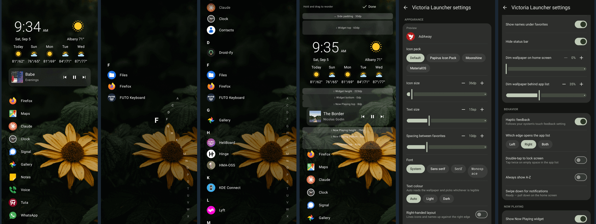

# Victoria Launcher

An open source alternative to [Niagara Launcher](https://niagaralauncher.app) — a
minimal, list-based Android home screen.



## Install

Coming to [F-Droid](https://f-droid.org). Until then, build it yourself with the
steps below.

Once it is installed, pick Victoria Launcher under
**Settings → Apps → Default apps → Home app**.

Requires Android 8.0 (API 26) or newer.

## Build

You need JDK 17 and an Android SDK with platform 35.

```sh
./gradlew assembleDebug
```

See [CONTRIBUTING.md](docs/CONTRIBUTING.md) for the full build and contribution
notes, and [ARCHITECTURE.md](docs/ARCHITECTURE.md) for how the code fits together.

## Licence

[GPL-3.0-or-later](LICENSE)
